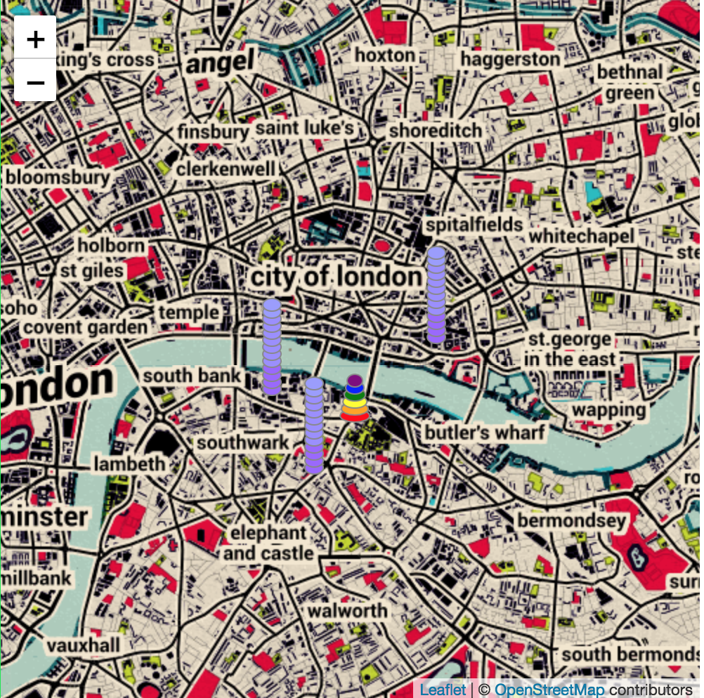

# Description

A plugin for (React-Leaflet 1.x.x)[https://github.com/PaulLeCam/react-leaflet] bringing over the original (leaflet-marker-stack)[https://github.com/IvanSanchez/Leaflet.Marker.Stack] plugin to render vertically stacked chip icons onto a (leaflet)[https://github.com/Leaflet/Leaflet] map.

Tested and supported with React-Leaflet 1.9.1. Not supported by React-Leaflet 2.x.x

# Installation

```
npm install react-leaflet-marker-stack@next

# or

yarn add react-leaflet-marker-stack@next
```

# Usage Example



```
import React, { Component } from 'react'
import MarkerStack from 'react-leaflet-marker-stack'
import { Map, TileLayer } from 'react-leaflet'

// Be sure to include Leaflet's CSS file in main index.html file.

export default class App extends Component {
  constructor() {
    super()
    this.state = {
      lat: 51.505,
      lng: -0.09,
      zoom: 13
    }

    this.buildIcons = this.buildIcons.bind(this)
  }

  buildIcons() {
    const data = [
      { amount: 1000 },
      { amount: 2000 },
      { amount: 3000 },
      { amount: 4000 },
      { amount: 5000 },
      { amount: 6000 }
    ]
    return data.map(item => {
      if (item.amount >= 6000) return { color: 'purple', iconSize: [10, 8], iconAnchor: [5, 4] }
      if (item.amount >= 5000) return { color: 'blue', iconSize: [12, 8], iconAnchor: [6, 4] }
      if (item.amount >= 4000) return { color: 'green', iconSize: [14, 8], iconAnchor: [7, 4] }
      if (item.amount >= 3000) return { color: 'yellow', iconSize: [16, 8], iconAnchor: [8, 4] }
      if (item.amount >= 2000) return { color: 'orange', iconSize: [18, 8], iconAnchor: [9, 4] }
      if (item.amount >= 1000) return { color: 'red', iconSize: [20, 8], iconAnchor: [10, 4] }
    })
  }

  render() {
    const mapStyle = { height: '500px', width: '500px' }
    const position = [this.state.lat, this.state.lng]
    return (
      <Map style={mapStyle} center={position} ref="map" zoom={this.state.zoom}>
        <TileLayer
          attribution="&amp;copy <a href=&quot;http://osm.org/copyright&quot;>OpenStreetMap</a> contributors"
          url="https://{s}.tile.openstreetmap.org/{z}/{x}/{y}.png"
        />
        <MarkerStack position={position} icons={this.buildIcons()} />
      </Map>
    )
  }
}
```

## Documentation

`<MarkerStack position={} icons={}/>` takes `position` and `icons` props.

`Position` can be an array of [Lat, Lon] values or an object of {lat: "-30.0", lng: "40.0"} values.

`Icons` should be an array consisting of a specific object shape to customize the icons.

- color: can be any CSS color property
- iconSize: is an array containing [Width, Height] values
- iconAnchor: is an array containing [X, Y] offsets of the icon.
- border: can be any CSS border property (ex: `red solid 1px`)

Credit to (react-leaflet-distance-marker)[https://github.com/fullhdpixel/react-leaflet-distance-marker] for a largely copied react-leaflet plugin example
) and (Leaflet.Marker.Stack)[https://github.com/IvanSanchez/Leaflet.Marker.Stack]
] for providing the source for the actual non-react plugin.
